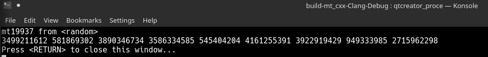
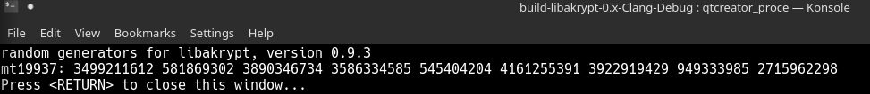

# Libakrypt: mt19937

## Что было изменено в библиотеке и в каких файлах:

### ak_oid.c

Библиотека `libakrypt` поддерживает свое собственное дерево идентификаторов, корнем
которого служит последовательность `1.2.643.2.52.1`. Генераторы псевдо-случайных чисел
используют  `1.2.643.2.52.1.1`
  
  Для принятого в бибилиотеке поиска   добавлены с идентификатором `1.2.643.2.52.1.1.5` и именем `mt19937`:
  
  ```c
  static const char *asn1_mt19937_n[] =     { "mt19937", NULL };
  static const char *asn1_mt19937_i[] =     { "1.2.643.2.52.1.1.5", NULL };
  
  ```
  
  ```c
  { random_generator, algorithm, asn1_mt19937_i, asn1_mt19937_n, NULL,
  {{ sizeof( struct random ), (ak_function_create_object *)ak_random_create_mt19937,
                             (ak_function_destroy_object *)ak_random_destroy, NULL, NULL, NULL },
                                                               ak_object_undefined, NULL, NULL }}
  ```

### libakrypt.h 

В struct random  в union data  добавлена struct MT для внутреннего состояния mt19937

```c
struct {
   ak_uint32 mt[624];
   int index;
   ak_uint32 value;
} MT;
 ```

Добавлена инициализация контекста mt19937 
 
```c
  dll_export int ak_random_create_mt19937( ak_random );
```

### ak_random.c

Добавлена реализация класса rng_mt19937  

Определены функции:
(тело функций в readme не выносилось)

```c
static int ak_random_mt19937_next( ak_random rnd );

static int ak_random_mt19937_randomize_ptr( ak_random rnd, const ak_pointer ptr, const ssize_t size );

static int ak_random_mt19937_random( ak_random rnd, const ak_pointer ptr, const ssize_t size );
```

```c

 int ak_random_create_mt19937( ak_random generator )
 {
     int error = ak_error_ok;
     ak_uint32 dword = (ak_uint32)ak_random_value();

     if(( error = ak_random_create( generator )) != ak_error_ok )
         return ak_error_message( error, __func__ , "wrong initialization of random generator" );

     generator->oid = ak_oid_find_by_name( "mt19937" );
     generator->next = ak_random_mt19937_next;
     generator->randomize_ptr = ak_random_mt19937_randomize_ptr;
     generator->random = ak_random_mt19937_random;

     /* для корректной работы присваиваем какое-то случайное начальное значение */
      ak_random_mt19937_randomize_ptr( generator, &dword, sizeof( ak_uint32 ));
      return error;
 }
```


### ../examples/test-random01.c

Тестовый файл переделан для проверки mt19937. Функция test_function выводит
сгенерированную последовательность чисел, каждое число unsigned int (ak_uint32)
seed задается внутри функции и равен 5489;

```c
void  test_function( ak_function_random create )
{
 struct random generator;
 ak_uint32 seed[1] = {5489}; /* seed */
 int i = 0;
 ak_uint32 buffer[9]; /* массив сгенерированных значений по 32 бита */
 create( &generator );
 printf( "%s: ", generator.oid->name[0] ); fflush( stdout );
 if( generator.randomize_ptr != NULL )
       ak_random_randomize( &generator, &seed, sizeof( seed ));
       
  ak_random_ptr( &generator, buffer, 9 );

  for( i = 0; i < 9; i++ )
  {
      printf( "%u ", buffer[i] );
  }
  printf( "  \n" );
  ak_random_destroy( &generator );
}
```


### ../MT_test/

Является отдельным с++ проектом , со своим cmakelists.txt для проверки работы Вихря Мерсенна, 
std::mt19937 генератор вызывается с таким же seed, как и для mt19937 libakrypt:

```c
std::mt19937 generator (5489);
```

Также в данном каталоге находятся скриншоты с выводом терминалов для обоих случаев

## Про mt19937, который встраивался:

### Алгоритм:

#### Описание: 

В приложенном в classroom отчете 

### Параметры:

(w, n, m, r) = (32, 624, 397, 31)
a = 9908B0DF16
(u, d) = (11, FFFFFFFF16)
(s, b) = (7, 9D2C568016)
(t, c) = (15, EFC6000016)
l = 18

most significant w-r bits - 0x80000000
least significant r bits -  0x7fffffff

## Результаты:
 
Последовательность, полученная с помощью  std::mt19937 из \<random> для C++:


Последовательнось, полученная с помощью функции после встраивания в Libakrypt:


Вывод: полученные последовательности совпадают. 


